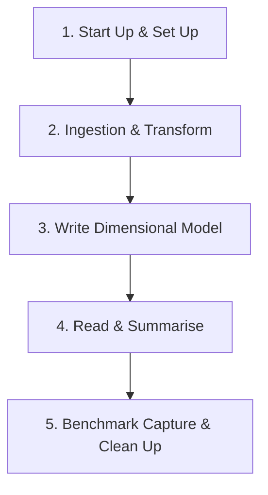

**TL;DR** — This post analyses the results of benchmarking different data processing engines on [Microsoft Fabric](https://www.microsoft.com/en-us/microsoft-fabric). We compare [Pandas](https://pandas.pydata.org/), [PySpark](https://spark.apache.org/docs/latest/api/python/index.html), [Polars](https://pola.rs/), and [DuckDB](https://duckdb.org/) across various compute configurations. The results provide concrete, Fabric-specific evidence for a broader industry trend: for medium-scale datasets (anything up to ~100GB), modern in-process engines like DuckDB and Polars on single-node Python notebooks are consistently faster and up to 5x cheaper than distributed Spark clusters.

## The Broader Context: A Platform Responding to a Shift

This benchmarking study doesn't exist in isolation. It is the latest instalment in our [Adventures in Polars](https://endjin.com/blog/tag/adventures-in-polars) and [DuckDB](https://endjin.com/blog/tag/duckdb) series, in which we have been making the case that a fundamental shift is underway in how organisations approach analytical data processing.

The argument, which we have explored in depth across both series, centres on what Hannes Mühleisen (co-creator of DuckDB and Professor of Data Engineering at the University of Nijmegen) calls the **"data singularity"**: the point at which the processing power of mainstream single-node machines surpasses the requirements of the vast majority of analytical workloads. We introduced this concept in [DuckDB: The Rise of In-Process Analytics and Data Singularity](https://endjin.com/blog/2025/04/duckdb-rise-of-in-process-analytics-understanding-data-singularity) and revisited it from a Polars perspective in [Why Polars Matters for Decision Makers](https://endjin.com/blog/2026/01/why-polars-matters-for-decision-makers).

The core observation is straightforward: CPU core counts, RAM, and NVMe storage throughput have all improved dramatically over the past decade, while the size of most *useful* analytical datasets has grown far more slowly. Amazon's own internal Redshift telemetry, [analysed by MotherDuck](https://motherduck.com/blog/redshift-files-hunt-for-big-data/), suggests we are already close to the singularity — the 99th percentile of datasets in a production big data platform fits comfortably on a modern laptop. Their data suggests we are spending around 94% of query dollars on computation that doesn't actually need big data infrastructure.

The problem, historically, was that most data tools were designed *before* this shift. They could not take advantage of modern hardware capabilities. That gap gave rise to a new generation of **in-process analytics engines** — built to exploit the full potential of a single, well-resourced machine. Two tools stand out: [DuckDB](https://duckdb.org/) for those who prefer SQL, and [Polars](https://pola.rs/) for those who prefer a DataFrame API. Both re-engineer the analytics stack from the ground up: column-oriented storage, vectorized execution across all available CPU cores, and intelligent query planning that eliminates unnecessary work. Neither requires a cluster. Neither has network overhead, authentication complexity, or the coordination costs of distributed systems.

The practical implication, and the hypothesis this benchmarking study was designed to test, is that for the majority of enterprise analytical workloads, these tools running on a single well-resourced node will outperform Spark at a fraction of the cost.

## Microsoft Fabric's Response: The Python Notebook

It is telling that Microsoft has recognised this shift at a platform level. The introduction of [**Python Notebooks**](https://learn.microsoft.com/en-us/fabric/data-engineering/using-python-experience-on-notebook) to Microsoft Fabric is a direct response to the in-process analytics movement.

Where Fabric's Spark Notebooks provision a distributed cluster on demand (with all the associated overhead in spin-up time, coordination cost, and capacity consumption) Python Notebooks provide a single, configurable execution node. They come **pre-installed with both DuckDB and Polars**, a notable design choice that signals Microsoft's acknowledgement that these tools have earned their place in the enterprise data stack. Microsoft explicitly recommends both as alternatives to Pandas for memory-intensive workloads.

In parallel, both DuckDB and Polars have added direct support for **OneLake** — the storage platform that underpins Fabric. DuckDB's native Delta extension enables querying Delta tables stored in a Fabric Lakehouse via `delta_scan()`, reading directly from OneLake paths without additional configuration. Polars similarly supports reading and writing Delta tables via `pl.read_delta()`, `pl.scan_delta()`, and `df.write_delta()`, with OneLake authentication handled through Fabric's `notebookutils`. Both tools also support standard ABFS paths, enabling direct interaction with raw files in the Lakehouse Files area. We have covered these integration patterns in detail in [DuckDB Workloads on Microsoft Fabric](https://endjin.com/blog/2025/04/duckdb-workloads-on-microsoft-fabric) and [Polars Workloads on Microsoft Fabric](https://endjin.com/blog/2026/01/polars-workloads-on-microsoft-fabric).

The Python Notebook is configurable across a range of single-node sizes (2, 4, 8, 16, 32, and 64 vCores, with memory scaling proportionally). This is a meaningful range: a 32-vCore Python Notebook gives DuckDB or Polars access to substantially more parallelism than even a well-resourced Spark executor, without any of the coordination overhead of distributed execution.

What follows is our attempt to put hard numbers behind these claims, using a realistic enterprise workload on real Fabric infrastructure.

## Data Source

The use case is implemented using open data provided by the [UK Land Registry House Price Data open data repository](https://www.gov.uk/government/statistical-data-sets/price-paid-data-downloads), made available under an [Open Government Licence](https://www.nationalarchives.gov.uk/doc/open-government-licence/version/3/).

The data is provided as a set of CSV files (one per calendar year) which have been downloaded to a Fabric Lakehouse. The dataset covers property sales since 1995, with approximately 1 million transactions per year. In total, 30 years of historic data amounts to roughly 30 million rows and ~5GB of raw CSV.

This scale is deliberate. We find that many published benchmarks focus on processing datasets that are rarely encountered in practice. Our objective is to focus on the scale we more commonly encounter in enterprise client engagements — medium-scale datasets that are interesting enough to stress-test the differences between engines, but representative of the workloads that most data teams actually run day to day. The data fits in memory for all configurations tested, which is precisely where in-process engines are designed to excel.

## Use Case

The use case mimics a common set of data transformations typical for data of this nature:

1. **Start Up & Set Up** — provisioning the platform (Spark or Python), then completing startup tasks such as importing Python packages.
2. **Ingestion & Transform** — reading raw data from a set of CSV files, standardising, cleaning, and adding derived features.
3. **Write Dimensional Model** — writing different slices of the transformed data to the Lakehouse in Delta format for downstream consumption, in this case as a dimensional model for Power BI.
4. **Read and Summarise** — reading the Delta tables back and running analysis based on filtering, joining, and summarising data across different dimensions.
5. **Benchmark Capture & Clean Up** — capturing timestamps and memory consumption metrics at each stage and persisting them to the Lakehouse for analysis.

This pipeline exercises the full range of operations that matter to data engineers: reading raw files at scale, executing complex transformations, writing Delta tables, and querying structured data back. It is a fair test of what each engine is actually optimised to do.

## Fabric Platforms

Fabric offers multiple notebook environments. For this study we used two:

- **Spark notebooks** — a notebook experience over an on-demand Spark cluster, configurable in terms of vCores, memory, and number of executor nodes. Enables polyglot development (Python, R, SQL) across a distributed compute environment.

- **Python notebooks** — a more recent addition to Fabric. Python notebooks provision a single execution node sized according to pre-defined configurations (vCores and memory). Whilst positioned for "smaller" workloads, we find that the majority of enterprise use cases can be comfortably accommodated on this platform when the right tooling is chosen.

## Workloads

The study compares four data processing engines running the same use case on Fabric:

1. **Pandas** — the default Python library for data engineering. Vast ecosystem, but single-threaded and constrained to datasets that fit in memory. Serves as a baseline.

2. **PySpark** — the Python API for Apache Spark. Designed for distributed computation across clusters and widely deployed via Databricks and Azure Synapse. The incumbent choice for enterprise-scale data engineering.

3. **Polars** — a Rust-based engine with a Python API. Designed from the ground up to exploit modern hardware: automatic parallelisation across all available cores, lazy evaluation with query plan optimisation, and memory-efficient columnar processing. We explored Polars' technical foundations in detail in [Polars Technical Deep Dive](https://endjin.com/blog/2026/01/polars-technical-deep-dive).

4. **DuckDB** — a C++ in-process analytical database with a Python API. Optimised for OLAP workloads, capable of querying CSV files and Delta tables directly, and able to use disk for larger-than-memory datasets. We covered DuckDB's internals — columnar storage, vectorized execution, zone maps — in [DuckDB In Depth: How It Works and What Makes It Fast](https://endjin.com/blog/2025/04/duckdb-in-depth-how-it-works-what-makes-it-fast).

## Fabric Capacity and Capacity Units (CUs)

A Fabric capacity is a dedicated pool of compute resources purchased from Azure — a fixed amount of computational horsepower continuously available to workspaces assigned to it. When you purchase a Fabric capacity (e.g. F8, F64), you are reserving that number of capacity units (CUs) for continuous use across all workloads: notebooks, pipelines, warehouses, Power BI, and so on.

CUs are Fabric's abstraction layer for billing compute across heterogeneous workloads. Different engines have different conversion rates, meaning your F64 capacity represents different amounts of practical compute depending on which engine is consuming it.

Consumption is measured in **CU Seconds**: the number of CUs consumed multiplied by duration in seconds. The fundamental formula for both Spark and Python Notebooks in Fabric is 0.5 CU per second per vCore, though for Spark the total vCore count must account for driver and all executor nodes:

- A Python Notebook sized at 8 vCores consumes **4 CUs per second**.
- A Spark Notebook with 1 driver (8 vCores) and 1 executor (8 vCores) consumes **8 CUs per second**.

This billing asymmetry is significant and, as the results below will show, it creates a strong economic case for Python Notebooks when the workload doesn't genuinely require distributed execution.

## Configurations

Achieving direct parity across Spark and Python notebook platforms is not straightforward. We opted for configurations that allow a range of CU-per-second comparisons, including some like-for-like points:

| CUs Per Second | Python Notebook Configuration              | Spark Pool Configuration                                  |
| -------------- | ------------------------------------------ | --------------------------------------------------------- |
| 1              | **2 vCores, 16G RAM** [Default for Python] |                                                           |
| 2              | 4 vCores, 32G RAM                          |                                                           |
| 4              | 8 vCores, 64G RAM                          | 1 Executor 4/4 vCores 28G/28G RAM                         |
| 6              |                                            | 2 Executors 4/4 vCores 28G/28G RAM                        |
| 8              | 16 vCores, 128G RAM                        | **1 Executor 8/8 vCores 56G/56G RAM** [Default for Spark] |
| 10             |                                            | 4 Executors 4/4 vCores 28G/28G RAM                        |
| 12             |                                            | 2 Executors 8/8 vCores 56G/56G RAM                        |
| 16             | 32 vCores, 256G RAM                        |                                                           |
| 20             |                                            | 4 Executors 8/8 vCores 56G/56G RAM                        |

The default Python Notebook (2 vCores, 16GB RAM) is **8x cheaper per second** to run than the default Spark Notebook (1 Executor 8/8 vCores 56G/56G RAM). The smallest Spark configuration (1 Executor 4/4 vCores 28G/28G) is equivalent in CU cost to the 8-vCore Python Notebook which provides ~2.5x the RAM, and as the results show, very significant computational throughput when running DuckDB or Polars.

Spin-up times are also materially different, and matter for development workflows. Python Notebooks at the default 2-vCore configuration provision in under 30 seconds. Spark clusters in this study took between 3 and 3.5 minutes at all configurations tested:

| Platform                                        | Configuration                           | Median Provisioning Time |
| :---------------------------------------------- | :-------------------------------------- | -----------------------: |
| **Fabric PySpark Notebook** [Default for Spark] | 01 executors 08/08 cores 56g/56g memory |                     18.6 |
| **Fabric Python Notebook** [Default for Python] | 02 vCores                               |                   24.356 |
| Fabric Python Notebook                          | 16 vCores                               |                   125.15 |
| Fabric Python Notebook                          | 08 vCores                               |                  129.215 |
| Fabric Python Notebook                          | 32 vCores                               |                  132.767 |
| Fabric Python Notebook                          | 04 vCores                               |                  136.243 |
| Fabric PySpark Notebook                         | 02 executors 08/08 cores 56g/56g memory |                  188.749 |
| Fabric PySpark Notebook                         | 04 executors 08/08 cores 56g/56g memory |                  192.767 |
| Fabric PySpark Notebook                         | 01 executors 04/04 cores 28g/28g memory |                  194.956 |

When developing directly in Fabric notebooks we use the default platform configurations operating on test data.  Then scale up the configuration as needed in production.

With DuckDB and Polars, we favour local development given the access this gives us to modern IDEs, coding agents and unit testing frameworks.  Faster provisioning directly improves the developer inner loop. Shorter iteration cycles during development compound over the course of a project. This is consistent with our experience migrating client workloads from Spark to in-process engines, where test suite runtimes dropped from minutes to seconds and local development became a practical reality again.

## Methodology

Multiple runs were completed for each combination of engine, workload, and configuration. Median execution times are reported throughout to reduce the influence of outliers.

## Analysis

### Elapsed Time Analysis

Elapsed time analysis **includes** the time to spin up the required Spark or Python environment. Environments with faster provisioning therefore have an inherent advantage here. Note that spin-up time does not incur a CU cost on Fabric — if cost is your primary concern, skip ahead to the Execution Time Analysis.

The table below shows median elapsed times for each workload on its default environment:

| Platform                | Configuration                           | Workload          | CUs Per Second | Median Elapsed Time | Percentage of Min Elapsed Time |
| :---------------------- | :-------------------------------------- | :---------------- | -------------: | ------------------: | -----------------------------: |
| Fabric PySpark Notebook | 01 executors 08/08 cores 56g/56g memory | pyspark_benchmark |              8 |             125.691 |                            100 |
| Fabric Python Notebook  | 02 vCores                               | duckdb_benchmark  |              1 |              133.59 |                          106.3 |
| Fabric Python Notebook  | 02 vCores                               | polars_benchmark  |              1 |             174.876 |                          139.1 |
| Fabric Python Notebook  | 02 vCores                               | pandas_benchmark  |              1 |             275.515 |                          219.2 |

Key observations:

- PySpark (on its default 8-CU environment) is the fastest at elapsed time (~126 seconds), but only marginally so.
- DuckDB on the default Python Notebook (1 CU per second) runs in ~134 seconds — just 6% slower — at **one-eighth the CU cost**.
- Polars on the same minimal configuration completes in ~175 seconds, also at one-eighth the cost.
- Pandas, the incumbent default, takes over four minutes — roughly twice Spark's elapsed time.

### Execution Time Analysis

Execution time **excludes** spin-up and environment provisioning, enabling a direct comparison between engines across configurations at equivalent CU costs.

The **Top 10** results are presented below:

- DuckDB achieves the fastest pure execution time, on an 8-vCore Python Notebook with 64GB RAM.
- DuckDB and Polars occupy 8 of the top 10 positions before Spark appears.
- The fastest Spark execution time is more than twice that of DuckDB — which achieves its best result on infrastructure with half the CU cost.

| Rank | Platform                | Configuration                           | Workload          | CUs Per Second | Median Execution Time | Percentage of Min Execution Time |
| ---: | :---------------------- | :-------------------------------------- | :---------------- | -------------: | --------------------: | -------------------------------: |
|    1 | Fabric Python Notebook  | 08 vCores                               | duckdb_benchmark  |              4 |                47.037 |                              100 |
|    2 | Fabric Python Notebook  | 04 vCores                               | duckdb_benchmark  |              2 |                66.405 |                            141.2 |
|    3 | Fabric Python Notebook  | 16 vCores                               | duckdb_benchmark  |              8 |                72.794 |                            154.8 |
|    4 | Fabric Python Notebook  | 32 vCores                               | duckdb_benchmark  |             16 |                80.182 |                            170.5 |
|    5 | Fabric Python Notebook  | 16 vCores                               | polars_benchmark  |              8 |                 86.28 |                            183.4 |
|    6 | Fabric Python Notebook  | 08 vCores                               | polars_benchmark  |              4 |                88.203 |                            187.5 |
|    7 | Fabric Python Notebook  | 32 vCores                               | polars_benchmark  |             16 |                90.787 |                              193 |
|    8 | Fabric Python Notebook  | 04 vCores                               | polars_benchmark  |              2 |               102.398 |                            217.7 |
|    9 | Fabric PySpark Notebook | 01 executors 08/08 cores 56g/56g memory | pyspark_benchmark |              8 |               107.091 |                            227.7 |
|   10 | Fabric Python Notebook  | 02 vCores                               | duckdb_benchmark  |              1 |               107.871 |                            229.3 |

The line chart below shows median execution times across all engines and configurations, with CUs per second as the common measure of both environment size and cost:

Key observations:

- Execution time for all engines initially decreases as more cores and memory become available, but there is a clear **"sweet spot"** beyond which performance plateaus or even degrades slightly. Throwing more infrastructure at a problem does not guarantee faster results and can actually make things slower.
- At comparable CU levels (e.g. 4 CUs per second), DuckDB and Polars on Python Notebooks significantly outperform PySpark on Spark Notebooks.

This "sweet spot" behaviour is consistent with what we know about how DuckDB and Polars are engineered. Both tools use automatic parallelisation across available cores, but there is an overhead to thread coordination that grows with core count. Beyond the point where all available parallelism is fully utilised, adding more cores yields diminishing returns.

## CU Cost Analysis

Shifting focus from execution time to cost, the following table lists the 10 cheapest engine/configuration combinations:

| Workload          | Configuration                           | CUs Per Second | Median Execution Time | Total Cost (CUs) | Percentage of Min Cost |
| :---------------- | :-------------------------------------- | -------------: | --------------------: | ---------------: | ---------------------: |
| duckdb_benchmark  | 02 vCores                               |              1 |               107.871 |          107.871 |                    100 |
| duckdb_benchmark  | 04 vCores                               |              2 |                66.405 |           132.81 |                  123.1 |
| polars_benchmark  | 02 vCores                               |              1 |               156.885 |          156.885 |                  145.4 |
| duckdb_benchmark  | 08 vCores                               |              4 |                47.037 |          188.148 |                  174.4 |
| polars_benchmark  | 04 vCores                               |              2 |               102.398 |          204.796 |                  189.9 |
| pandas_benchmark  | 02 vCores                               |              1 |                250.84 |           250.84 |                  232.5 |
| polars_benchmark  | 08 vCores                               |              4 |                88.203 |          352.812 |                  327.1 |
| pandas_benchmark  | 04 vCores                               |              2 |               224.122 |          448.244 |                  415.5 |
| duckdb_benchmark  | 16 vCores                               |              8 |                72.794 |          582.352 |                  539.9 |
| pyspark_benchmark | 01 executors 04/04 cores 28g/28g memory |              4 |               149.619 |          598.478 |                  554.8 |

The cheapest Spark run costs more than 5x the cheapest DuckDB run and approximately 4x the cheapest Polars run. Even Pandas on the default minimal Python Notebook is cheaper than the most economical Spark configuration.

## Execution Time versus Cost

The following scatter chart provides a two-dimensional view of all engine/configuration combinations tested. The horizontal x-axis shows execution time; the vertical y-axis shows cost on a logarithmic scale.

The sweet spot (best combination of fast execution and low cost) lies in the **bottom-left quadrant**. That space is dominated by DuckDB and Polars.

## Stage Analysis: What Separates DuckDB from Polars?

Both DuckDB and Polars are modern in-process query engines built for exactly this kind of workload, yet DuckDB consistently comes out ahead. The stage-level analysis reveals where that advantage is won.

DuckDB's edge appears consistently in the stages that involve **reading from the Fabric Lakehouse** — specifically, reading Delta format tables. DuckDB uses its own native Delta extension for this purpose, reading directly from OneLake without additional dependencies. Polars, by contrast, currently uses the `delta-rs` package for Delta reads.

This is an important distinction in the context of Microsoft Fabric's architecture. OneLake stores data in Delta format, and any engine that can query Delta tables natively has a structural advantage. It is worth watching whether Polars develops its own native Delta reader over time; if it does, the gap between the two engines may narrow.

## Conclusions

This benchmarking study provides concrete, Fabric-specific evidence for what we have been arguing across the broader series: in-process analytics engines running on single-node infrastructure are a serious and, for most workloads, superior alternative to distributed Spark.

1. **Modern in-process engines outperform Spark for medium-scale workloads** — DuckDB and Polars delivered faster execution times than PySpark across all comparable configurations, often by a factor of 2x or more. The claims we made in our [DuckDB](https://endjin.com/blog/2025/04/duckdb-rise-of-in-process-analytics-understanding-data-singularity) and [Polars](https://endjin.com/blog/2026/01/why-polars-matters-for-decision-makers) series hold up under real Fabric workloads.

2. **Cost efficiency strongly favours Python Notebooks with modern engines** — the cheapest Spark configuration costs 4-5x more than the cheapest DuckDB run for equivalent work. For teams with finite Fabric capacity budgets, this is a material consideration. Profile your workload, start small, and scale to Spark only when you genuinely need it.

3. **More resources don't always mean faster execution** — there is a "sweet spot" for resource allocation beyond which performance plateaus or degrades. This challenges the intuition that scaling infrastructure will proportionally improve throughput. Both DuckDB and Polars are efficient enough that 4-8 vCores often delivers the best balance of speed and cost.

4. **Default configurations are not equal — and the gap matters** — the default Python Notebook (2 vCores) is 8x cheaper per second to run than the default Spark Notebook, yet delivers comparable elapsed-time performance when using DuckDB or Polars. For development workloads, the Python Notebook should be the default choice.

5. **DuckDB's native Delta reader provides a measurable edge** — the stage analysis suggests DuckDB's advantage over Polars comes primarily from its native Delta reading capability. This is a meaningful finding in the context of Fabric, where Delta is the dominant table format. It reinforces one of DuckDB's core design principles: eliminate friction wherever data meets compute.

6. **Microsoft is responding to the in-process analytics movement** — the introduction of Python Notebooks pre-installed with DuckDB and Polars, combined with OneLake support in both tools, signals that the platform is evolving to accommodate this shift. Teams investing in these tools are aligned with the direction of travel, not swimming against it.

The data singularity is not a theoretical future state — it is arriving now, and platforms like Microsoft Fabric are starting to reflect that. For most enterprise analytical workloads, the question is no longer whether single-node in-process engines can handle the job. Based on the evidence here, they can deliver a faster and cheaper than the distributed alternative.

So which workloads does Spark still justify its overhead?  Reserve Spark for datasets that genuinely exceed single-node memory capacity, or for workloads where Fabric-specific Spark optimisations (V-ORDER, Liquid Clustering) are demonstrably valuable. For everything else, DuckDB and Polars on a Python Notebook are the pragmatic choice.

The good news is that Microsoft Fabric offers makes all of these compute options available to you, underpinned by Delta format and [OneLake](https://learn.microsoft.com/en-us/fabric/onelake/onelake-overview) as the common storage layer.  So you are not forced to make a choice up front, you have the flexibility to adapt without being forced to move data or adopt a different platform.